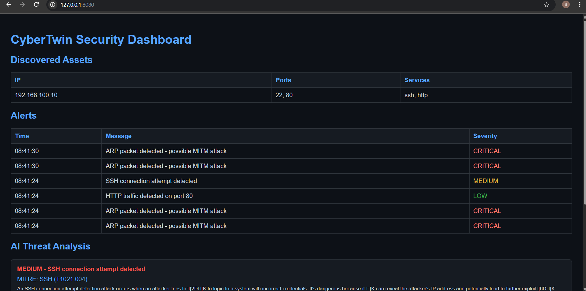

# CyberTwin-AI — Digital Twin Attack Simulation Platform
## Dashboard Screenshots

An AI-powered cybersecurity platform that simulates real-world attacks, detects them in real time, and uses AI to automatically analyze threats.

## What it does
- Discovers network devices and open ports
- Simulates 6 real-world attacks (Nmap, Nikto, Hydra, DDoS, ARP poisoning, Metasploit)
- Detects attacks in real time using custom Python IDS
- Analyzes threats using SentinelRAG (RAG pipeline with MITRE ATT&CK + Llama3.2)
- Displays everything on a live Flask dashboard

## Tech Stack
Python, Flask, ChromaDB, Ollama, Llama3.2, MITRE ATT&CK, tcpdump, Nmap, Metasploit, VirtualBox

## Architecture
Attack Simulation → IDS Detection → RAG Analysis → Live Dashboard

## Setup
1. Install VirtualBox
2. Create Kali Linux and Ubuntu Server VMs
3. Clone this repo on Ubuntu
4. Install dependencies: pip3 install -r requirements.txt
5. Run: python3 app.py

## Modules
- scanner/ — Network asset discovery
- monitoring/ — Real time IDS
- sentinelrag/ — AI threat analysis
- templates/ — Flask dashboard# Cybertwin-ai
AI-powered digital twin attack simulation platform
